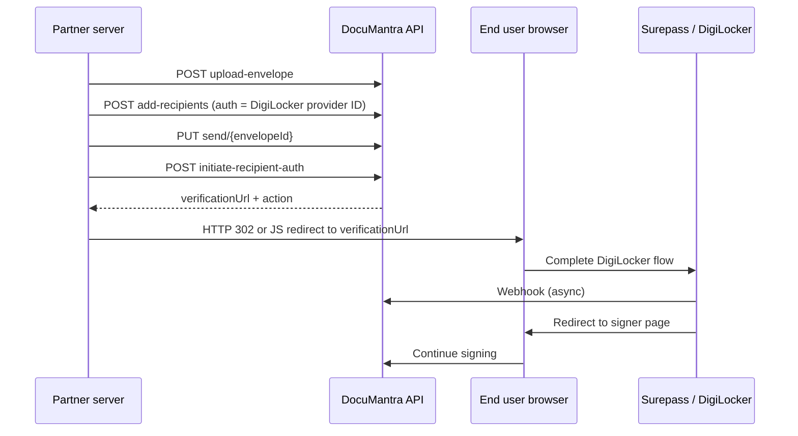

# S2S Integration Guide — DigiLocker Identity Verification

Technical reference for partners integrating **server-to-server (S2S)** with DocuMantra e-sign and redirecting end users to **DigiLocker** (via Surepass DigiLocker Via Link).

**Base URL (production):** `https://esp.documantra.in`

---

## Overview

DigiLocker is not called directly. DocuMantra uses **Surepass DigiLocker Via Link** (`digilocker_link` auth provider). Your integration:

1. Creates an envelope and assigns a recipient with DigiLocker authentication
2. Calls an API to **initiate auth** for that recipient
3. Receives a **`verificationUrl`** in the response
4. **Redirects the user’s browser** to that URL
5. User completes Aadhaar/DigiLocker on Surepass
6. Surepass webhook notifies DocuMantra; recipient is marked verified
7. User returns to the signer page to complete signing



---

## Prerequisites

### 1. API credentials

| Item | How to obtain |
|------|----------------|
| **JWT** | `POST /service/api/api-service/generate` with `mode: "sandbox"` or `"production"` |
| **Sandbox API key** | Returned with JWT; send as `X-Sandbox-Api-Key` header |
| **DigiLocker provider ID** | Admin → Auth Providers → **DigiLocker Via Link** (`providerType: digilocker_link`) |

### 2. Admin setup (DigiLocker provider)

1. Admin → **Auth Providers**
2. Ensure **DigiLocker Via Link** exists (`npm run seed:digilocker-auth` in subscription-service if missing)
3. Set:
   - **API key** — Surepass bearer token
   - **Callback URL** — `https://esp.documantra.in/webhook/surepass-digilocker`
   - **SUREPASS_API_BASE_URL** — `https://sandbox.surepass.app` (sandbox) or `https://kyc-api.surepass.app` (production)

### 3. Required headers (partner API)

```http
Authorization: Bearer <JWT>
X-Sandbox-Api-Key: <sandbox-api-key>
Content-Type: application/json
```

---

## Integration flow (recommended)

### Step 1 — Upload envelope

```http
POST /service/api/api-service/sign/upload-envelope
Content-Type: multipart/form-data
Authorization: Bearer <JWT>
X-Sandbox-Api-Key: <key>

files: <PDF file(s)>
```

**Response (example):**
```json
{
  "envelopeId": "674a1b2c3d4e5f6789012345",
  "message": "Envelope created"
}
```

### Step 2 — Add recipients with DigiLocker auth

```http
POST /service/api/api-service/sign/add-recipients
Authorization: Bearer <JWT>
X-Sandbox-Api-Key: <key>
Content-Type: application/json
```

```json
{
  "envelopeId": "674a1b2c3d4e5f6789012345",
  "recipients": [
    {
      "name": "Raj Kumar",
      "email": "raj@example.com",
      "role": "signer",
      "order": 1,
      "authentication": "<DIGILOCKER_AUTH_PROVIDER_ID>"
    }
  ]
}
```

`authentication` can be:
- A single provider ObjectId string
- Or JSON array: `[{"authMethodId":"<id>","status":"pending"}]`

### Step 3 — Save fields & send envelope

```http
POST /service/api/api-service/sign/save-signature-fields
POST /service/api/api-service/sign/update
PUT  /service/api/api-service/sign/send/{envelopeId}
```

### Step 4 — Initiate DigiLocker (S2S redirect)

**New partner endpoint:**

```http
POST /service/api/api-service/sign/initiate-recipient-auth
Authorization: Bearer <JWT>
X-Sandbox-Api-Key: <key>
Content-Type: application/json
```

**Request:**
```json
{
  "providerId": "<DIGILOCKER_AUTH_PROVIDER_ID>",
  "envelopeId": "674a1b2c3d4e5f6789012345",
  "recipientData": {
    "id": "<RECIPIENT_ID>",
    "email": "raj@example.com",
    "phone": "+919876543210"
  }
}
```

> `recipientData.id` is the recipient ID returned from add-recipients / envelope detail.

**Success response (DigiLocker):**
```json
{
  "status": "pending",
  "message": "DigiLocker verification initiated. You will be redirected to complete Aadhaar verification.",
  "action": "COMPLETE_IDENTITY_VERIFICATION",
  "verificationUrl": "https://sandbox.surepass.app/digilocker?token=...",
  "metadata": {
    "clientId": "surepass-client-id-abc123"
  }
}
```

### Step 5 — Redirect user to DigiLocker

When `action === "COMPLETE_IDENTITY_VERIFICATION"`:

**Server-side redirect (recommended):**
```http
HTTP/1.1 302 Found
Location: <verificationUrl>
```

**Or client-side:**
```javascript
window.location.href = response.verificationUrl;
```

### Step 6 — After verification

Surepass calls DocuMantra webhook and redirects the user to:

```
https://esp.documantra.in/e-sign/signer/{envelopeId}/{recipientId}
```

Poll status (optional):

```http
GET /identity/webhook/surepass-digilocker/status/{clientId}
```

Or fetch envelope:

```http
GET /service/api/api-service/sign/envelope/{envelopeId}
```

Check recipient `authentication` / verification status before allowing signature.

---

## Alternative: subscription service (direct)

If you host your own signer UI and only need the DigiLocker URL:

```http
POST /subscription/api/authproviders/initiate/auth
Content-Type: application/json
```

Same request body as Step 4. Same response shape.

> This endpoint is currently **unauthenticated**. For production partners, call through the **api-service** partner endpoint above (JWT + API key) or request IP allowlisting.

---

## Alternative: identity service (low-level S2S)

For custom integrations that manage Surepass themselves:

```http
POST /identity/api/identity/digilocker/start
Content-Type: application/json
```

```json
{
  "userId": "<recipient-or-user-id>",
  "authProviderId": "<provider-id>",
  "apiKey": "<surepass-bearer-token>",
  "envelopeId": "<envelope-id>",
  "webhookUrl": "https://esp.documantra.in/webhook/surepass-digilocker",
  "apiBaseUrl": "https://sandbox.surepass.app"
}
```

**Response:**
```json
{
  "success": true,
  "url": "https://sandbox.surepass.app/digilocker?token=...",
  "clientId": "surepass-client-id",
  "redirectUrl": "https://esp.documantra.in/e-sign/signer/{envelopeId}/{recipientId}"
}
```

Redirect user to `url`.

---

## Response actions reference

| `action` | Meaning | Partner action |
|----------|---------|----------------|
| `COMPLETE_IDENTITY_VERIFICATION` | DigiLocker / KYC redirect required | Redirect to `verificationUrl` |
| `ENTER_OTP` | Email/SMS OTP | Show OTP form; call verify endpoints |
| `CAPTURE_SELFIE` | Selfie verification | Show camera UI |
| `LIVENESS_CHECK` | Liveness check | Show liveness UI |

---

## Webhooks (DigiLocker completion)

| URL | Method | Purpose |
|-----|--------|---------|
| `/webhook/surepass-digilocker` | POST | Surepass server webhook |
| `/webhook/surepass-digilocker/return` | GET | Browser return after DigiLocker |
| `/webhook/surepass-digilocker/status/:clientId` | GET | Poll session status |

**Webhook payload (simplified):**
```json
{
  "client_id": "surepass-client-id",
  "status": "success"
}
```

On success, DocuMantra updates the recipient via:

```http
POST /esign/api/e-sign/public/recipients/update-verification-status
```

---

## Error handling

| HTTP | Cause |
|------|-------|
| 400 | Missing `providerId`, `recipientData`, or `envelopeId` |
| 403 | Invalid or inactive sandbox API key |
| 404 | Auth provider not found |
| 500 | Surepass/identity service error; check provider API key and callback URL |

**Example error:**
```json
{
  "message": "Failed to reach identity service for DigiLocker"
}
```

---

## Signer URL (hosted UI)

If you do not build a custom UI, send users directly to:

```
https://esp.documantra.in/e-sign/signer/{envelopeId}/{recipientId}
```

The hosted signer page calls `initiate/auth` automatically and redirects to DigiLocker when required.

---

## DigiLocker vs Aadhaar e-sign

| Feature | DigiLocker KYC | V-Sign Aadhaar e-sign |
|---------|----------------|------------------------|
| Purpose | Identity verification before signing | Cryptographic Aadhaar signature |
| Provider | Surepass DigiLocker Link | V-Sign ESP |
| Callback | `/webhook/surepass-digilocker` | `/esign/api/e-sign/public/v-sign/response` |

Both may apply to the same envelope depending on configured auth methods.

---

## Partner checklist

- [ ] Sandbox JWT + API key obtained
- [ ] DigiLocker auth provider configured in admin (Surepass token + webhook URL)
- [ ] Envelope created with `authentication` = DigiLocker provider ID
- [ ] `POST initiate-recipient-auth` returns `verificationUrl`
- [ ] User redirect to `verificationUrl` works
- [ ] Webhook URL reachable from Surepass (`/webhook/surepass-digilocker`)
- [ ] Recipient verification status = completed before signature
- [ ] Production: switch Surepass base URL to `https://kyc-api.surepass.app`

---

## Related docs

- [Mailgun setup](./MAILGUN_SETUP.md)
- [Federated login setup](./FEDERATED_LOGIN_SETUP.md) (if present)
- Seed script: `Backend/services/subscription-service/scripts/seed-digilocker-auth-provider.js`
